# Week 3 (1/19 - 1/25)

After the interview we decided on an initial goal to view the hourly trends on weekdays / weekends for pre-covid (2018-19) and post-covid (2023-24) intervals for the various ATR sites provided.

## Notable data issues

### Inconsistent naming of ATR LocationIDs

Selecting all the unique `LocationID`s from the aggregate `parquet` datafile gives some strange `ID` formats. For one example we have:

| `LocationID`      | My interpretation                           |
| ------------      | -----------------                           |
| 03011             | Base ID for Wilsonville                     |
| 0301101           | bidirectional for lane 1?                   |
| 0301101_NB        | NB for lane 1?                              |
| 0301103           | bidirectional for lane 3?                   |
| 0301103_1_SB      | not sure                                    |
| 0301103_2_SB      | not sure                                    |
| 0301103_3_SB      | not sure                                    |
| 0301103_SB        | lane 3 SB?                                  |
| 03011_1_NB        | lane 1 NB                                   |
| 03011_1_SB        | lane 1 SB                                   |
| 03011_2_NB        | lane 2 NB                                   |
| 03011_2_SB        | lane 2 SB                                   |
| 03011_3_NB        | lane 3 NB                                   |
| 03011_3_SB        | lane 3 SB                                   |
| 03011_NB          | all lanes NB                                |
| 03011_SB          | all lanes SB                                |

I don't think 0301103 or 0301101 are new IDs since I can't find them in the ATR metadata file provided. Additionally, the `SITE_ID` column in the metadata file seems to chop off leading 0's so to match I just removed leading 0's from `LocationID`.

### Inconsistent Direction column values

The unique values for this column are:

Expected Values:
- WB
- NB
- SB
- EB
- None

Strange but understandable, may have to identify if these are missing from the 'None' categories:
- 1-WAY
- 2-WAY

Must be mistakes:
- 1
- 2
- 3
- 4

And when `Directions` is a number it seems to match the lane information parsed from `LocationID`. If the direction value parsed from the `LocationID` is reliable then updating some of these is an easy fix (already applied in the code).

## Results and Analysis

Here we plot the hourly pre- vs post-covid ATR count data averages and IQRs. The columns correspond to the direction of travel and the rows to weekdays and weekend data. Generally, the post-covid trends are below the pre-covid ones. It isn't immediately clear if this is due to congestion or less demand.

NOTE: These plots only make sense to me if the times are UTC... Shifting each plot 8 hours to the left to get PST would make them more sensible.

### Interstate Bridge

These results don't seem to line up with the provided information of lane occlusion in the 2024 data but maybe the impact is smaller than the increase in volume?

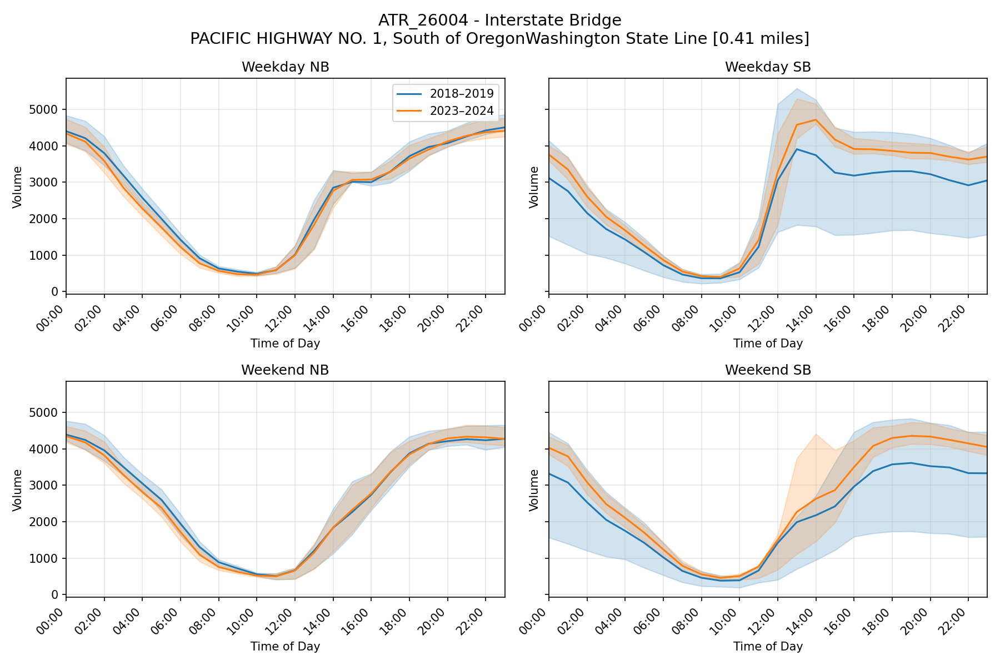

### Glenn Jackson Bridge
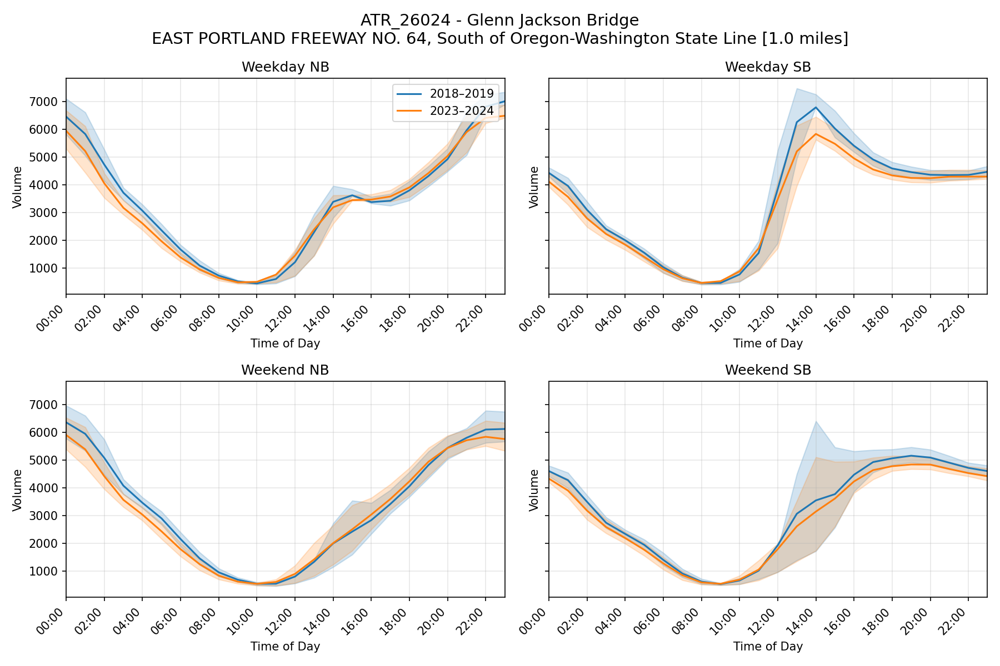

### Wilsonville
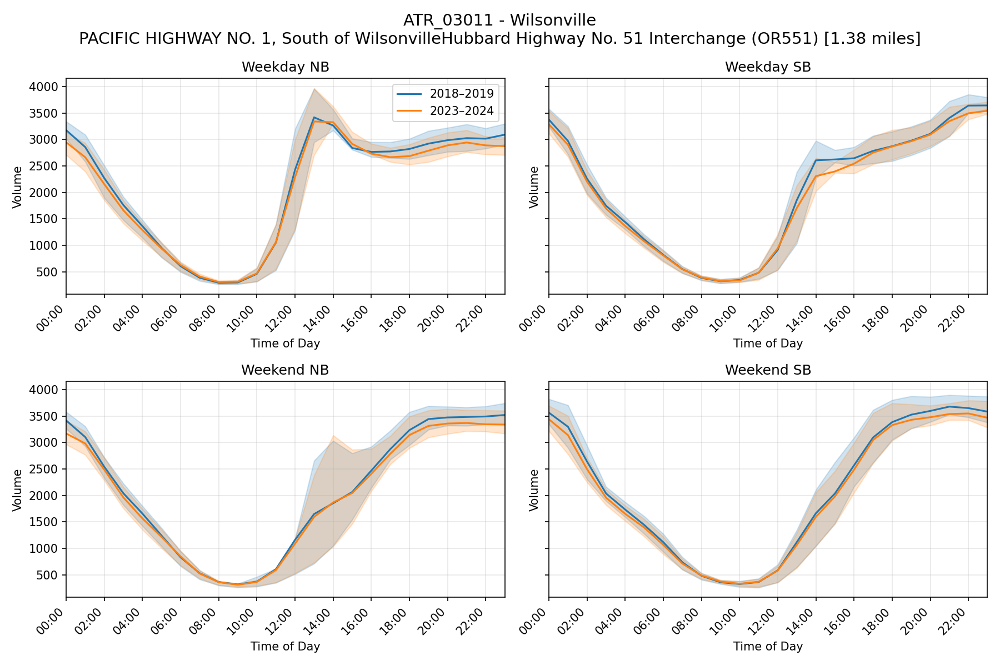

### Vista Ridge

The mean trend going outside of the IQR here is concerning... This indicates either extreme values in the data or bugs in the code, but I haven't investigated it yet since the rest of the plots look reasonable.

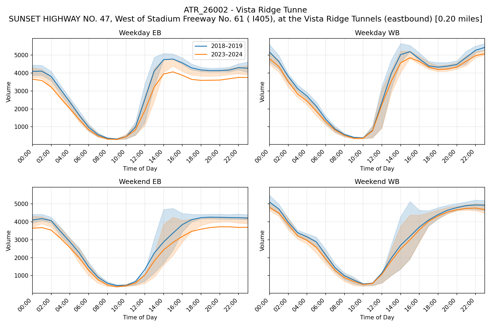

### Lents
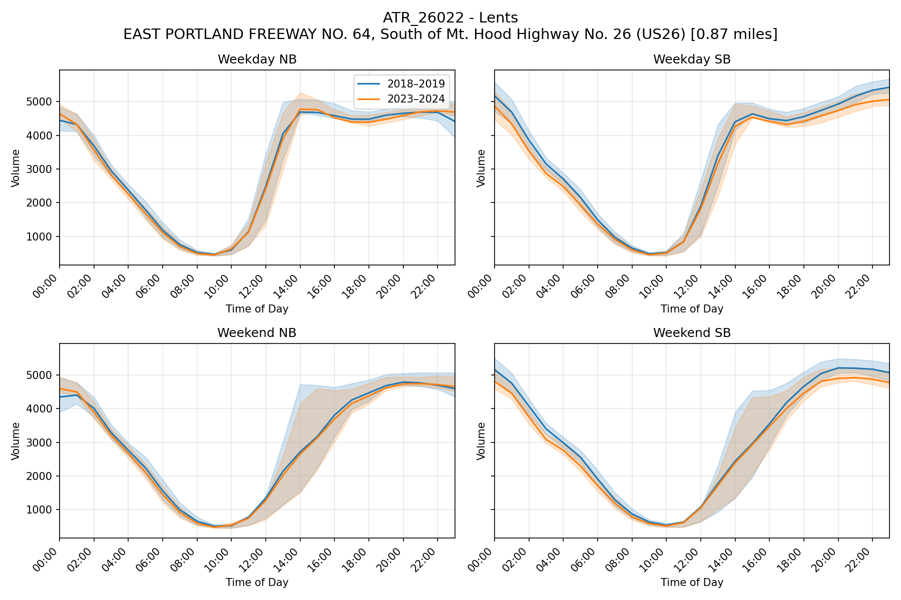

### Beaverton-Bethany
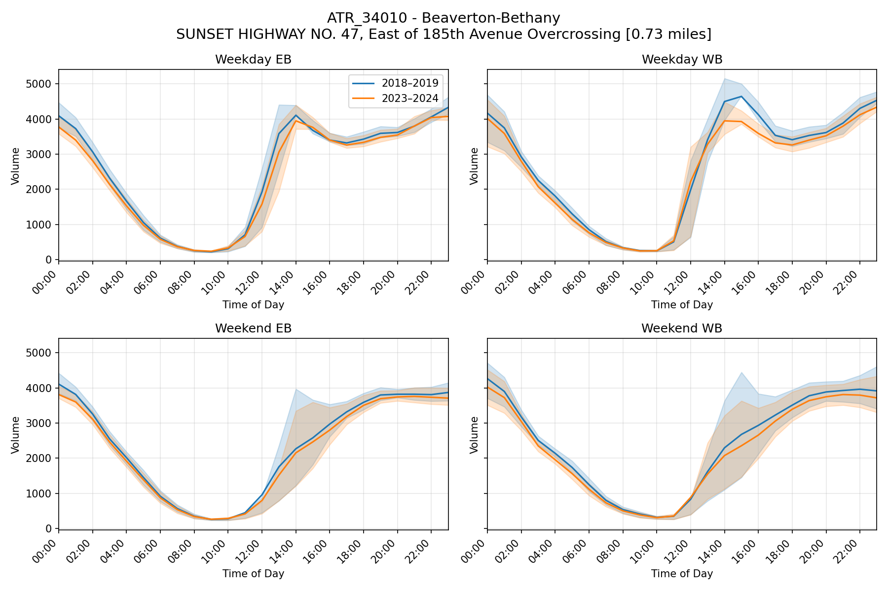

### Stafford
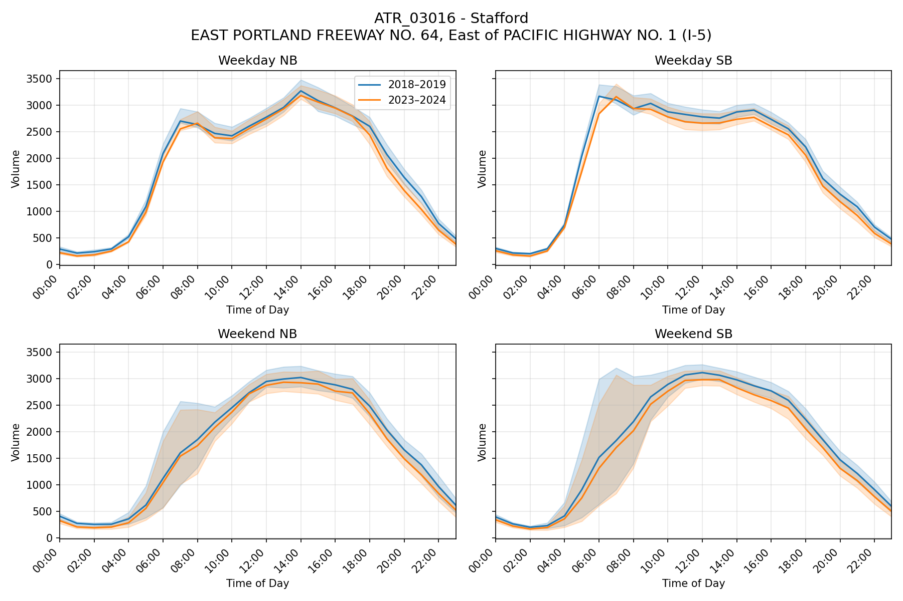

### Hoyt
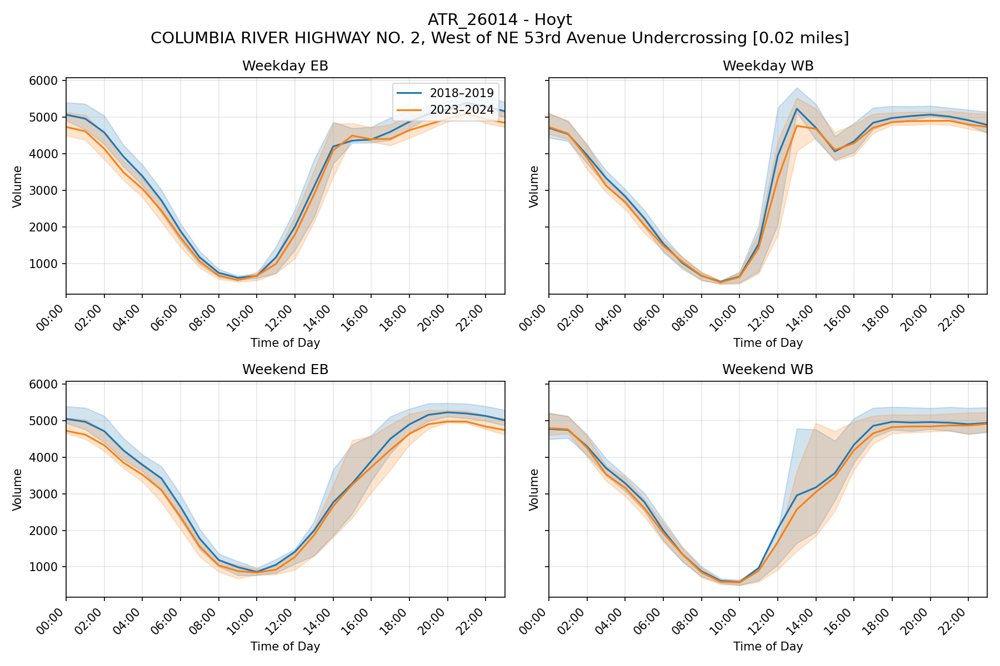

### Fairview
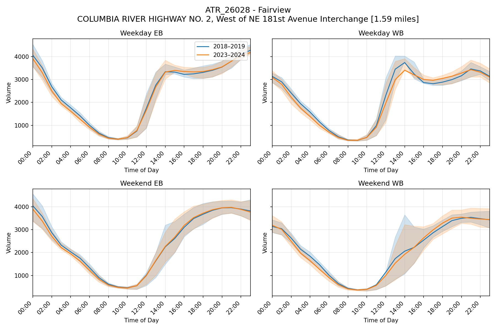

### Troutdale
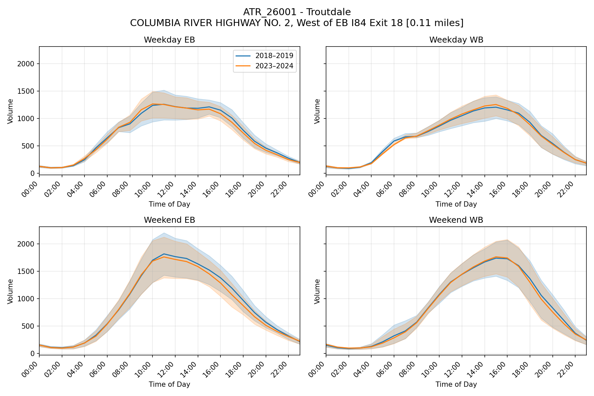

### Iowa Street
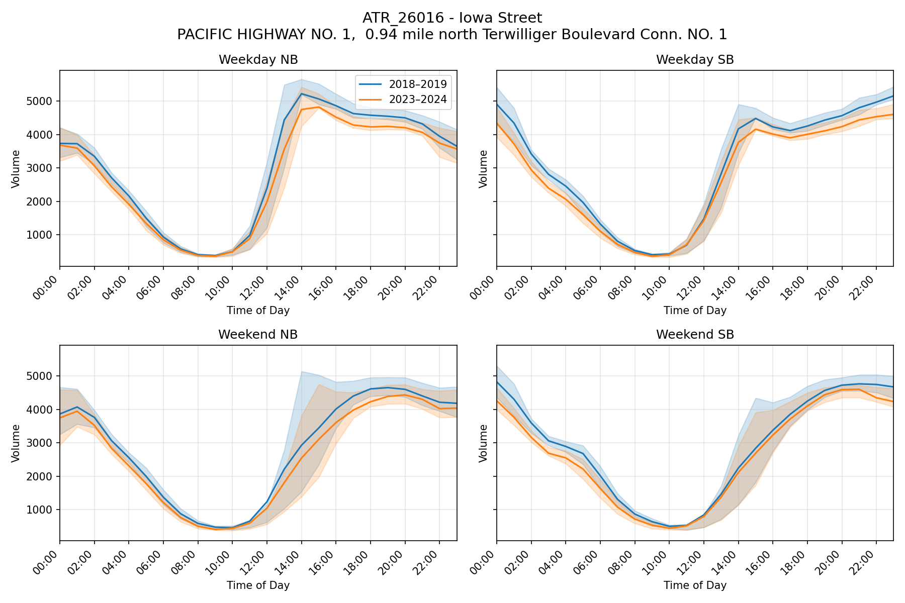

### North Plains
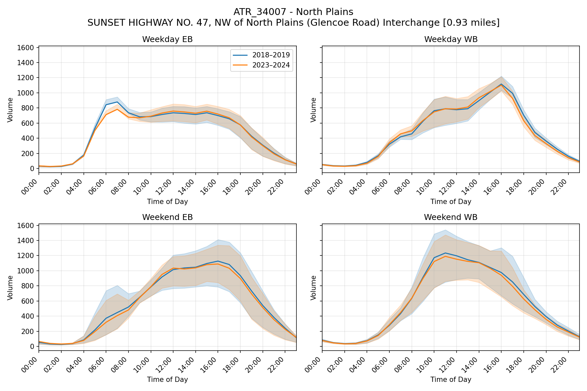

